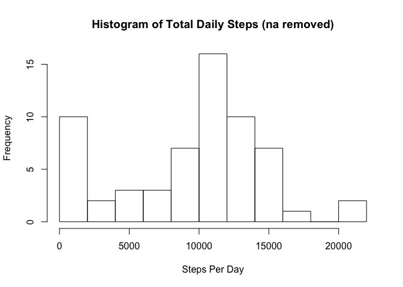
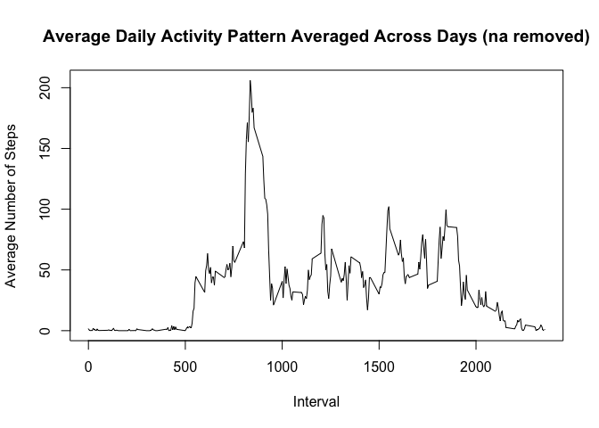

# Reproducible Research: Peer Assessment 1


## Loading and preprocessing the data

```r
## URL of the dataset
sourceDataURL <- 'https://d396qusza40orc.cloudfront.net/repdata%2Fdata%2Factivity.zip'
## File names for data
fileList <- c('activity.csv')
## Temporary File for storing the downloaded zip then extract the files we want into R
temp <- tempfile()
download.file(sourceDataURL, temp, method = "libcurl")
## Read the file from the source
activity.data <- read.csv("activity.csv", colClasses = c("numeric", "character", "numeric"))
## Make real dates
activity.data[, "date"] <- as.Date(activity.data[, "date"], "%Y-%m-%d")
## Summarize data
## Total steps by day
total.daily.steps <- aggregate(activity.data[, "steps"], by = list(activity.data[, "date"]), FUN = sum, na.rm = TRUE)
colnames(total.daily.steps) <- c("date", "daily.steps")
## Mean steps by interval
total.interval.steps <- aggregate(activity.data[, "steps"], by = list(activity.data[, "interval"]), FUN = mean, na.rm = TRUE)
colnames(total.interval.steps) <- c("interval", "mean.steps")
```
### Summary of the data read in

```r
summary(activity.data)
```

```
##      steps             date               interval     
##  Min.   :  0.00   Min.   :2012-10-01   Min.   :   0.0  
##  1st Qu.:  0.00   1st Qu.:2012-10-16   1st Qu.: 588.8  
##  Median :  0.00   Median :2012-10-31   Median :1177.5  
##  Mean   : 37.38   Mean   :2012-10-31   Mean   :1177.5  
##  3rd Qu.: 12.00   3rd Qu.:2012-11-15   3rd Qu.:1766.2  
##  Max.   :806.00   Max.   :2012-11-30   Max.   :2355.0  
##  NA's   :2304
```

## What is mean total number of steps taken per day?
### Histogram of the number of steps daily

```r
hist( 
      total.daily.steps[, "daily.steps"]
     ,xlab = "Steps Per Day"
     ,ylab = "Frequency"
     ,breaks = 10
     ,main = "Histogram of Total Daily Steps (na removed)"
    )
```

 

### Mean and Median daily steps

```r
mean(total.daily.steps[, "daily.steps"])
```

```
## [1] 9354.23
```

```r
median(total.daily.steps[, "daily.steps"])
```

```
## [1] 10395
```

The mean is 9354.2295082 and the median is 1.0395\times 10^{4}

## What is the average daily activity pattern?

Time series plot of interval activity

```r
plot(
      total.interval.steps[, "interval"]
     ,total.interval.steps[, "mean.steps"]
     ,type = "l"
     ,xlab = "Interval"
     ,ylab = "Average Number of Steps"
     ,main = "Average Daily Activity Pattern Averaged Across Days (na removed)"
    )
```

 

### What is the interval that contains the greatest average steps?

```r
ordered.total.interval.steps <- total.interval.steps[order(-total.interval.steps$mean.steps), ]
head(ordered.total.interval.steps, 1)
```

```
##     interval mean.steps
## 104      835   206.1698
```
## Imputing missing values
1. Calculate and report the total number of missing values in the dataset (i.e. the total number of rows with NAs)
2. Devise a strategy for filling in all of the missing values in the dataset. The strategy does not need to be sophisticated. For example, you could use the mean/median for that day, or the mean for that 5-minute interval, etc.
3. Create a new dataset that is equal to the original dataset but with the missing data filled in.
4. Make a histogram of the total number of steps taken each day and Calculate and report the mean and median total number of steps taken per day. Do these values differ from the estimates from the first part of the assignment? What is the impact of imputing missing data on the estimates of the total daily number of steps?

### 1.) Calculate the number of rows with na for steps

```r
sum(is.na(activity.data[, "steps"]))
```

```
## [1] 2304
```

### 2.) Devise a strategy to replace na values in the dataset
1. A first thought of strategy could be to put zeros (0) for all na values.  However, this isn't much better than omitting na values and would skew averages  
2. A better strategy is to replace the na value for an interval with the mean value for all days with that interval  
3. Any remaining na values will be set to zeros (0) since we don't have an average for that interval

### 3.) Create a new dataset equal to the original dataset but with all the missing data filled in

```r
## We already calculated the average steps per interval, summarize it again here for a reminder of the data
summary(total.interval.steps)
```

```
##     interval        mean.steps     
##  Min.   :   0.0   Min.   :  0.000  
##  1st Qu.: 588.8   1st Qu.:  2.486  
##  Median :1177.5   Median : 34.113  
##  Mean   :1177.5   Mean   : 37.383  
##  3rd Qu.:1766.2   3rd Qu.: 52.835  
##  Max.   :2355.0   Max.   :206.170
```

```r
## Given an index, if x row contains na for steps, lookup the mean.steps value
## otherwise return x row steps
replace.with.avg.steps <- function(index, x, mean.steps){
  if(is.na(x[index, "steps"])){
     mean.steps[mean.steps[, "interval"] == x[index, "interval"], "mean.steps"]
  } else {
    x[index, "steps"]
  }
}
## Move the data to a new variable and cleanup na values
imput.activity.data <- activity.data
imput.activity.data[, "steps"] <- sapply(
                                          1:length(imput.activity.data[, "steps"])
                                         ,FUN = replace.with.avg.steps
                                         ,x = imput.activity.data
                                         ,mean.steps = total.interval.steps
                                        )
## Summary of imput data
summary(imput.activity.data)
```

```
##      steps             date               interval     
##  Min.   :  0.00   Min.   :2012-10-01   Min.   :   0.0  
##  1st Qu.:  0.00   1st Qu.:2012-10-16   1st Qu.: 588.8  
##  Median :  0.00   Median :2012-10-31   Median :1177.5  
##  Mean   : 37.38   Mean   :2012-10-31   Mean   :1177.5  
##  3rd Qu.: 27.00   3rd Qu.:2012-11-15   3rd Qu.:1766.2  
##  Max.   :806.00   Max.   :2012-11-30   Max.   :2355.0
```
### 4.) Make a histogram with the imputted data, calculate mean and median...any difference to the earlier data when na values were removed?

## What is mean total number of steps taken per day?
### Histogram of the number of steps daily

```r
total.imput.daily.steps <- aggregate(imput.activity.data[, "steps"], by = list(imput.activity.data[, "date"]), FUN = sum)
colnames(total.imput.daily.steps) <- c("date", "daily.steps")

hist( 
      total.imput.daily.steps[, "daily.steps"]
     ,xlab = "Steps Per Day"
     ,ylab = "Frequency"
     ,breaks = 10
     ,main = "Histogram of Total Daily Steps (na replaced with mean for interval)"
    )
```

-1.png) 

### Mean and Median daily steps

```r
mean(total.imput.daily.steps[, "daily.steps"])
```

```
## [1] 10766.19
```

```r
median(total.imput.daily.steps[, "daily.steps"])
```

```
## [1] 10766.19
```
The mean is 1.0766189\times 10^{4} and the median is 1.0766189\times 10^{4}

Yes, there is quite a difference in the mean and median now that we filled in the average value for that interval instead of ignoring the row.  We now have more data points in the average and median and both have risen: old mean: 9354.2295082 new mean: 1.0766189\times 10^{4} old median: 1.0395\times 10^{4} new median: 1.0766189\times 10^{4} or a difference of around 1400 higher for the mean and 370 higher for the median

The impact after observing the histograms is that our frequencies of steps 

## Are there differences in activity patterns between weekdays and weekends?
